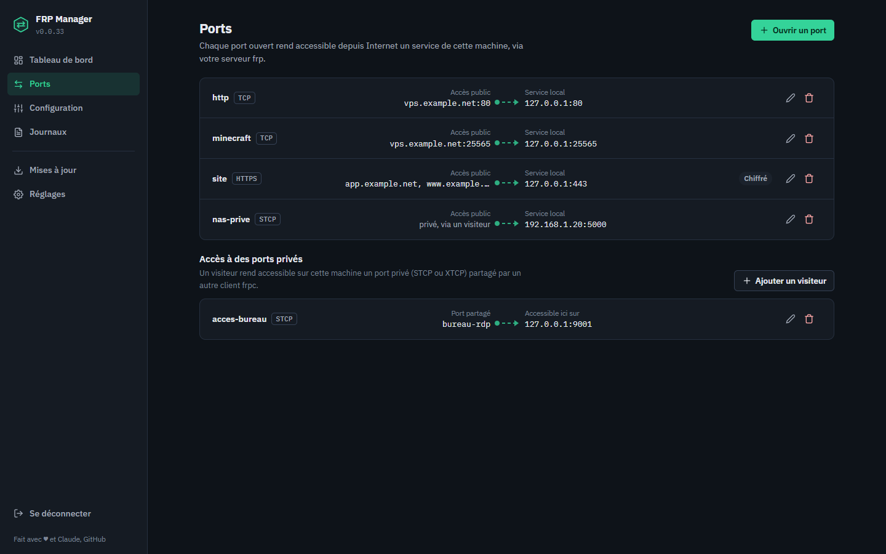
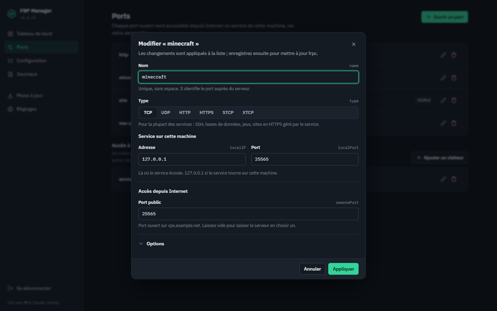

# 🌐 FRP Manager

> 🚀 Panel web auto-hébergé pour piloter [frp](https://github.com/fatedier/frp) (**frps** & **frpc**) sans ligne de commande : services, ports ouverts, configuration, journaux et mises à jour, dans une interface claire, en clair ou en sombre, sur ordinateur comme sur mobile.


[](https://github.com/Gogowwww/frp-manager/stargazers)
[](https://claude.ai)

---

## 📑 Sommaire

- [🖥️ Aperçu](#️-aperçu)
- [📖 Présentation](#-présentation)
- [✨ Fonctionnalités](#-fonctionnalités)
- [📋 Prérequis](#-prérequis)
- [⚙️ Installation](#️-installation)
- [🏷️ Versions et pré-releases](#️-versions-et-pré-releases)
- [🔧 Configuration du panel](#-configuration-du-panel)
- [🗂️ Structure des fichiers](#️-structure-des-fichiers)
- [🌍 Traduire le panel](#-traduire-le-panel)
- [🔒 Sécurité](#-sécurité)
- [🗑️ Désinstallation](#️-désinstallation)
- [🤝 Contribuer](#-contribuer)
- [📄 Licence](#-licence)

---

## 🖥️ Aperçu

| Tableau de bord | Ports |
|:---:|:---:|
|  |  |
| **Ouverture d'un port** | **Journaux en direct** |
|  |  |

<details>
<summary>⚙️ Réglages</summary>


</details>

---

## 📖 Présentation

**FRP Manager** gère vos instances **frps** (le serveur, sur la machine publique) et **frpc** (le client, qui expose vos services locaux à travers lui) depuis un navigateur.

Il détecte tout seul vos services systemd et vos conteneurs Docker frp, démarre en **HTTPS** avec un certificat auto-signé généré au premier lancement, et fonctionne aussi bien avec une seule instance qu'avec plusieurs serveurs frp en parallèle.

> 💡 **Pourquoi FRP Manager ?**
> frp est puissant, mais sa gestion reste manuelle : fichiers TOML, redémarrages systemd, logs via SSH. FRP Manager réunit tout ça dans une interface pensée pour être comprise sans connaître frp par cœur, tout en montrant la clé TOML de chaque réglage pour les habitués.

---

## ✨ Fonctionnalités

### 📊 Tableau de bord
- 🔍 **Détection automatique** des services frps/frpc (units systemd, binaires, configs) et des conteneurs Docker frp
- 🪪 **Une carte par instance** : état en clair (*En marche*, *Arrêté*, *Introuvable*), version, fichier de config, service
- ▶️ **Démarrer / Arrêter / Redémarrer** en un clic, **démarrage automatique** en interrupteur, rechargement de la config
- 🛑 **Confirmation avant d'arrêter** un frpc : si vous accédez au panel à travers l'un de ses ports, vous êtes prévenu
- ✏️ **Surnoms** d'instances (*« Serveur maison »*, *« Accès bureau »*…)
- 🔔 Alertes utiles en haut de page : panel sans mot de passe, mise à jour disponible
- ⚡ **État en direct** : poussé par WebSocket dès qu'un service change (repli sur une vérification toutes les 12 s si le WebSocket ne passe pas)

### 🔌 Ports (frpc)
- 🗺️ **Liste lisible** : chaque port montre son chemin `vps.exemple.net:25565 → 127.0.0.1:25565`
- 📝 **Éditeur guidé** : `tcp`, `udp`, `http`, `https`, `stcp`, `xtcp`, avec une explication pour chaque type ; port public, domaines ou clé secrète selon le type ; options PROXY protocol v1/v2, chiffrement, compression
- 🔐 **Visiteurs** (`[[visitors]]`) : accès local à un port privé STCP/XTCP partagé par une autre machine
- 💾 **Brouillon puis enregistrement** : les modifications s'accumulent, une barre propose *Enregistrer* ou *Enregistrer et redémarrer frpc* ; avertissement si vous quittez sans enregistrer
- 🧷 **Rien n'est perdu** : les réglages que l'interface ne gère pas (`subdomain`, `plugin`, `[proxies.healthCheck]`…) sont conservés tels quels

### ⚙️ Configuration (frps / frpc)
- 🧩 **Formulaire par sections** : l'essentiel visible (connexion, authentification, tableau de bord frp), le reste replié dans *Réglages avancés* (TLS, ports KCP/QUIC/vhost, limites, journalisation)
- 🏷️ Chaque champ affiche sa **clé TOML** et une aide courte
- 🛡️ Les ports d'un frpc sont **préservés** quand vous enregistrez sa configuration

### 📜 Journaux
- 📂 Source **journal systemd**, **fichier de log** ou **conteneur Docker** (avec ou sans `tty`)
- 📡 **Flux en direct par WebSocket** (`wss://` sur le panel en HTTPS) sur la source choisie (journal systemd ou fichier), avec repli automatique sur SSE si le WebSocket ne passe pas ; coloration des erreurs et avertissements, **filtre** de lignes

> 🔀 Derrière un reverse proxy, autorisez la mise à niveau WebSocket sur `/ws/` (nginx : `proxy_http_version 1.1;` + en-têtes `Upgrade` et `Connection`). Sans ça, le panel retombe simplement sur SSE.

### ⬆️ Mises à jour
- **frp** : vérification de la dernière version, installation en un clic avec **miroirs de secours** (ghproxy, ghfast, gh-proxy), **upload manuel** d'une archive si GitHub est inaccessible, test d'accès aux sources
- **Panel** : mise à jour en un clic (installation classique) ou commande `docker pull` à copier (Docker) ; une **pré-release ne propose jamais de mise à jour** (voir [Versions et pré-releases](#️-versions-et-pré-releases))

### 🎛️ Réglages
- 🔐 Identifiant et mot de passe du panel
- 🌐 Adresse et port d'écoute, durée de session
- 🎨 **Thème** système / clair / sombre, **langue** (le panel est prêt pour la traduction)

### 🐳 Docker
- Le panel peut tourner **dans un conteneur** et piloter frp **sur l'hôte** (via `nsenter`, sans systemd dans l'image)
- Il détecte et contrôle aussi les **conteneurs frpc/frps** d'autres stacks (démarrer, arrêter, redémarrer, journaux, ports)

---

## 📋 Prérequis

- 🐧 Linux avec **systemd**
- 🐍 **Python 3.8+** (installation classique) ou **Docker**
- 🏗️ Architectures : `amd64`, `arm64`, `arm`

> ℹ️ **Pas besoin d'installer frp avant** : `install.sh` télécharge `frps`/`frpc` et crée leurs services systemd. frp se met ensuite à jour depuis la page **Mises à jour**.

---

## ⚙️ Installation

### 🥇 Méthode 1 — Script d'installation (recommandée)

```bash
# 1. Télécharger la dernière release
curl -LO https://github.com/Gogowwww/frp-manager/releases/latest/download/frp-manager.zip
unzip frp-manager.zip && cd frp-manager

# 2. Installer (root requis)
sudo bash install.sh
```

Le script installe le panel dans un environnement Python isolé, crée le service systemd `frp-manager` et le démarre. Il **prépare aussi frp** :

- ⬇️ binaires `frps` / `frpc` dans `/usr/local/bin` (dernière version, avec miroirs de secours) ;
- 📄 configs par défaut `/etc/frp/frps.toml` et `/etc/frp/frpc.toml`, **uniquement si elles n'existent pas** ;
- 🧱 services `frps.service` et `frpc.service`, créés mais **ni activés ni démarrés** : vous les configurez puis les lancez depuis le panel.

### 🐳 Méthode 2 — Docker / Portainer

**Docker Compose :**
```bash
git clone https://github.com/Gogowwww/frp-manager.git && cd frp-manager
docker compose up -d
```

**Portainer :** *Stacks → Add stack → Repository*, URL `https://github.com/Gogowwww/frp-manager`, compose path `docker-compose.yml`, puis *Deploy the stack*.

| Image | Contenu |
|---|---|
| `ghcr.io/gogowwww/frp-manager:latest` | dernière release stable (**recommandé**) |
| `ghcr.io/gogowwww/frp-manager:X.Y.Z` | une version précise, pour la figer ou revenir en arrière |
| `ghcr.io/gogowwww/frp-manager:dev` | dernière pré-release, pour tester avant tout le monde |

> 🔧 Le conteneur utilise `pid: host` et `nsenter` pour atteindre le systemd de l'hôte, et le socket Docker pour les conteneurs frp. Les binaires frp sont lus et écrits dans `/usr/local/bin` de l'hôte via le montage `/host/usr/local/bin`.

L'interface est ensuite accessible sur :
```
https://VOTRE_IP:8765
```

> ⚠️ Le certificat est auto-signé : le navigateur affiche un avertissement au premier accès, c'est normal. Pour un certificat valide, placez le panel derrière un reverse proxy (nginx, Caddy).

---

## 🏷️ Versions et pré-releases

Chaque nouvelle version sort d'abord en **pré-release**, pour être testée avant d'être proposée à tout le monde. Les numéros se suivent (`0.0.25`, `0.0.26`…) et une pré-release validée devient la release définitive **avec le même numéro**, sans être reconstruite.

| | Pré-release | Release |
|---|---|---|
| Page GitHub | marquée *Pre-release* | *Latest* |
| Image Docker | `:X.Y.Z` + `:dev` | `:X.Y.Z` + `:latest` |
| Proposée aux panels stables | ❌ | ✅ |
| Proposée aux panels en pré-release (installation classique) | ✅ | ✅ |

- **Panel stable** : il ne voit que les releases, jamais les pré-releases.
- **Panel en pré-release, installation classique** : il suit le canal des pré-releases et le bouton « Mettre à jour » propose la version publiée la plus récente, pré-release ou release.
- **Panel en pré-release sous Docker** : aucune mise à jour proposée dans l'interface ; changez le tag de l'image (`:dev` pour suivre les pré-releases, `:latest` pour revenir aux releases).

Quand la pré-release installée devient une release définitive, le panel repasse de lui-même sur le canal stable.

> ℹ️ **0.0.26 : l'option « IP réelle » (go-mmproxy) est retirée.** Si vous l'utilisiez, le panel remet automatiquement les tunnels concernés sur leur vrai service au premier démarrage, redémarre frpc, puis supprime les relais, les règles de routage et le binaire `go-mmproxy`. Pour transmettre l'IP des visiteurs, utilisez l'option **PROXY protocol** avec un service qui la prend en charge (nginx, HAProxy…).

---

## 🔧 Configuration du panel

Tout se règle depuis la page **Réglages**. Le fichier sous-jacent est `/etc/frp-manager/frp-manager.json` :

```json
{
  "bind_host": "0.0.0.0",
  "bind_port": 8765,
  "username": "admin",
  "password_hash": "",
  "session_timeout": 3600,
  "ssl_enabled": true,
  "nicknames": {}
}
```

| 🔑 Clé | 📝 Description | 🎯 Défaut |
|---|---|---|
| `bind_host` | Adresse d'écoute (`127.0.0.1` derrière un reverse proxy) | `0.0.0.0` |
| `bind_port` | Port du panel | `8765` |
| `username` | Identifiant de connexion | `admin` |
| `password_hash` | Mot de passe haché (géré par l'interface) | `""` *(aucun)* |
| `session_timeout` | Durée de session en secondes | `3600` |
| `ssl_enabled` | HTTPS avec certificat auto-signé | `true` |
| `nicknames` | Surnoms des instances (gérés par l'interface) | `{}` |

> 🔁 `bind_host`, `bind_port` et `ssl_enabled` s'appliquent au prochain redémarrage de `frp-manager`.

---

## 🗂️ Structure des fichiers

```
📦 Dépôt
  app.py                   # Serveur Flask + API
  frp-autoupdate.py        # Mise à jour automatique de frp (cron)
  install.sh               # Installation classique
  Dockerfile, docker-compose.yml
  templates/
    index.html, login.html # Pages (coquille)
    partials/icons.html    # Icônes SVG
    assets/
      css/app.css          # Design system (thèmes clair/sombre)
      js/                  # Application (modules ES, sans étape de build)
        pages/             # Tableau de bord, Ports, Configuration, Journaux…
      locales/fr.js        # Textes de l'interface

📁 /opt/frp-manager/        # Panel installé (méthode script)
📁 /etc/frp-manager/        # Configuration du panel + certificats SSL
📁 /etc/frp/                # Configurations frps/frpc (TOML)
📁 /var/log/frp/            # Journaux frp
📁 /var/lib/frp-manager/    # État (versions installées)
📁 /etc/systemd/system/     # frp-manager.service, frps.service, frpc.service
📁 /etc/cron.d/             # frp-autoupdate (vérification quotidienne, 03h00)
```

---

## 🌍 Traduire le panel

Tous les textes de l'interface sont dans `templates/assets/locales/fr.js`. Pour ajouter une langue :

1. Copier `fr.js` en `en.js` (ou autre code de langue) et traduire les valeurs ;
2. Déclarer la langue dans `LOCALES` de `templates/assets/js/i18n.js` ;
3. Elle apparaît dans **Réglages → Préférences → Langue**, et le navigateur la choisit automatiquement si elle correspond à sa langue.

> Les messages renvoyés par le serveur restent pour l'instant en français.

---

## 🔒 Sécurité

- 🔑 **Définissez un mot de passe** dès l'installation (**Réglages → Sécurité**) : le tableau de bord vous le rappelle tant qu'il n'y en a pas
- 🧱 **Limitez l'accès par IP** (pare-feu) ou écoutez sur `127.0.0.1` derrière un reverse proxy
- 📜 Pour un **certificat valide**, utilisez un reverse proxy (nginx, Caddy) avec Let's Encrypt
- 🎲 Utilisez un **jeton frp long et unique** par serveur

---

## 🗑️ Désinstallation

```bash
sudo systemctl disable --now frp-manager
sudo rm /etc/systemd/system/frp-manager.service
sudo rm -rf /opt/frp-manager /etc/frp-manager /etc/cron.d/frp-autoupdate
sudo systemctl daemon-reload
```

> ⚠️ Les configurations frp (`/etc/frp/`) et les binaires (`/usr/local/bin/`) sont conservés.

---

## 🤝 Contribuer

Les contributions sont les bienvenues :

1. 🍴 Forkez le dépôt
2. 🌿 Créez une branche : `git checkout -b feature/ma-feature`
3. 💾 Commitez vos changements
4. 📬 Ouvrez une Pull Request

> 🐛 Bug ou idée ? Ouvrez une [issue](https://github.com/Gogowwww/frp-manager/issues).

---

## 📄 Licence

**Apache 2.0** — voir [LICENSE](LICENSE)

---

## 🙏 Remerciements

- [fatedier/frp](https://github.com/fatedier/frp) — le projet frp sans lequel rien de tout ça n'aurait de sens
- 💛 La communauté open source pour les retours et contributions

---

## ✨ Vibecoding

<div align="center">

*Ce projet a été entièrement conçu, développé et itéré en **vibecoding** avec l'IA.*

[](https://claude.ai)

> *« Vibe, iterate, ship. »*

</div>

---

## ⭐ Star History

[](https://www.star-history.com/?repos=Gogowwww%2Ffrp-manager&type=date&legend=bottom-right)
