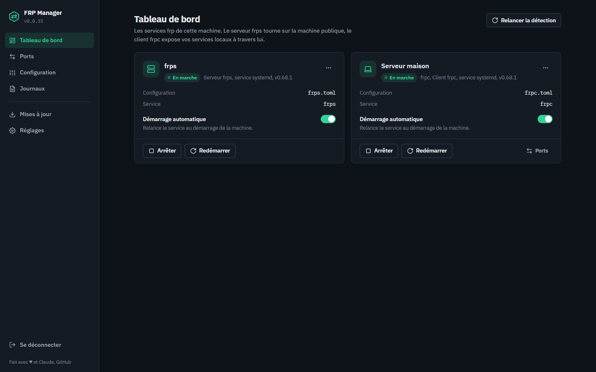
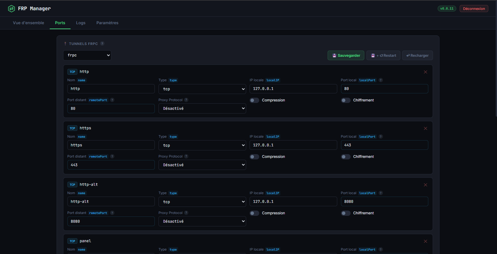
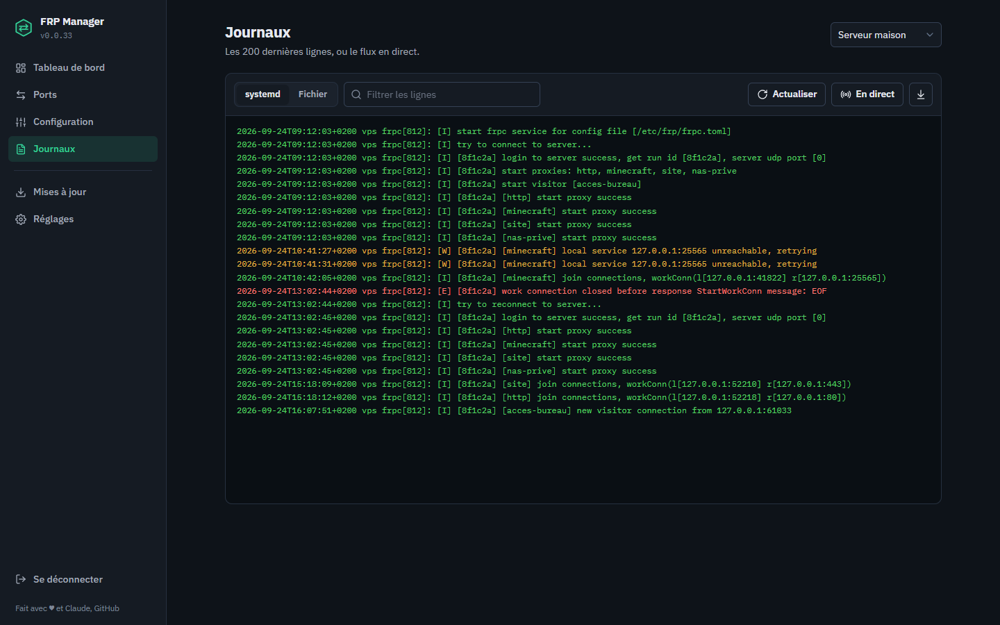
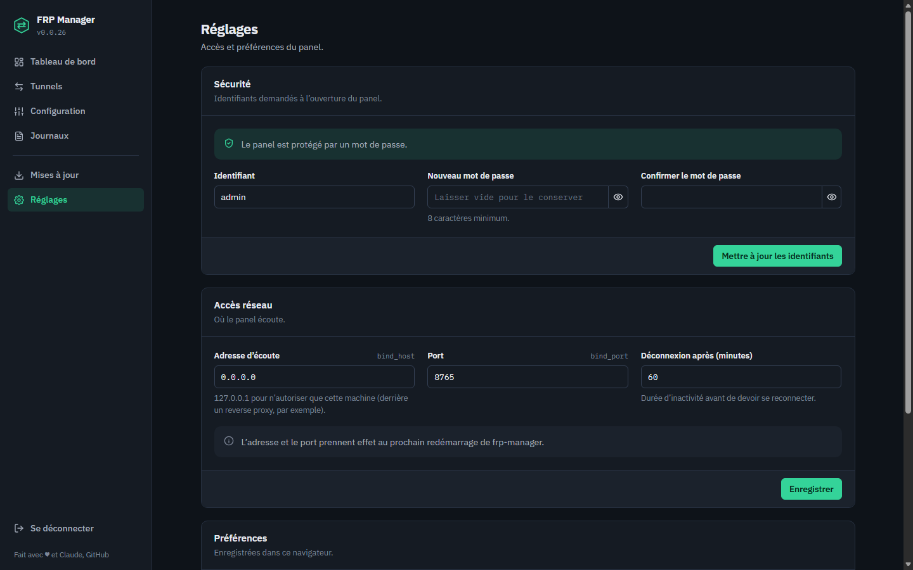

# 🌐 FRP Manager

> 🚀 Panneau web Flask pour piloter [frp](https://github.com/fatedier/frp) (**frps** & **frpc**) — multi-instances, services systemd auto-installés, HTTPS natif, éditeur TOML, logs temps réel & auto-update.


[](https://github.com/Gogowwww/frp-manager/stargazers)
[](https://claude.ai)

---

## 📑 Sommaire

- [🖥️ Aperçu](#️-aperçu)
- [📖 Présentation](#-présentation)
- [✨ Fonctionnalités](#-fonctionnalités)
- [📋 Prérequis](#-prérequis)
- [⚙️ Installation](#️-installation)
- [🗂️ Structure des fichiers](#️-structure-des-fichiers)
- [🔧 Configuration du panel](#-configuration-du-panel)
- [⬆️ Mise à jour de frp](#️-mise-à-jour-de-frp)
- [🔄 Mise à jour du panel](#-mise-à-jour-du-panel)
- [🔒 Sécurité](#-sécurité)
- [🗑️ Désinstallation](#️-désinstallation)
- [🤝 Contribuer](#-contribuer)
- [📄 Licence](#-licence)

---

## 🖥️ Aperçu

| Vue d'ensemble | Gestion des ports |
|:---:|:---:|
|  |  |
| **Logs en direct** | **Paramètres** |
|  |  |

---

## 📖 Présentation

**FRP Manager** est un panel web auto-hébergé pour gérer vos instances **frps** (serveur) et **frpc** (client) sans toucher à la ligne de commande.

Il détecte automatiquement vos services systemd existants, démarre en **HTTPS** avec un certificat auto-signé généré au premier lancement, et s'adapte à votre configuration — qu'il s'agisse d'une instance unique ou de plusieurs serveurs frp tournant en parallèle.

> 💡 **Pourquoi FRP Manager ?**
> frp est puissant mais sa gestion reste 100 % manuelle : édition de fichiers TOML, redémarrages systemd, suivi des logs via SSH. FRP Manager centralise tout ça dans une interface claire, accessible depuis n'importe quel navigateur.

---

## ✨ Fonctionnalités

### 📊 Vue d'ensemble
- 🔍 **Détection automatique** de tous les services frps/frpc (scan des units systemd, binaires, configs)
- 🪪 **Cartes d'état** par instance : statut actif/inactif, version, chemin du binaire et de la config, unit systemd
- ✏️ **Surnoms d'instances** : un nom lisible pour chaque frps/frpc (ex. *« Serveur principal »*, *« Tunnel bureau »*)
- 🎛️ **Contrôle des services** : Start, Stop, Restart, Reload, Enable, Disable — directement depuis l'interface
- 🔗 **Raccourcis** vers la config et les logs de chaque instance

### 📝 Configuration
- 🧩 **Formulaire interactif** avec tous les paramètres frps/frpc, organisés par importance :
  - **Section principale** : ports essentiels, authentification (token masqué + bouton révéler 👁️)
  - **Options avancées** (accordéon) : TLS, ports optionnels (KCP, QUIC, vhost), performance, logs
  - **Tunnels (proxies)** pour frpc : ajout dynamique en `tcp`, `udp`, `http`, `https`, `stcp`, `xtcp`, Proxy Protocol v1/v2
- 🛠️ **Mode TOML brut** pour les utilisateurs avancés
- 💾 **Sauvegarde + Reload** en un clic

### 📜 Logs
- 📂 Lecture via `journalctl` ou fichier log, pour toutes les instances
- 📡 **Streaming live** (SSE) avec coloration syntaxique (erreurs, warnings, succès)

### ⬆️ Mise à jour de frp
- 🔎 Vérification automatique de la dernière version sur GitHub
- 🪞 Téléchargement avec **miroirs de fallback** (ghproxy, ghfast, gh-proxy) si GitHub est bloqué
- 📦 **Upload manuel** d'une archive `.tar.gz` si tous les accès réseau sont coupés
- ♻️ Arrêt/redémarrage auto des services pendant la mise à jour (évite le *« Text file busy »*)
- 🧪 Test de connectivité des sources

### 🔄 Mise à jour du panel
- 🔎 Vérification de la dernière release depuis ce repo GitHub
- 🪄 **Auto-update en un clic** : télécharge le zip, remplace les fichiers, redémarre `frp-manager` automatiquement

### ⚙️ Paramètres
- 🌐 Configuration du panel : IP/port d'écoute, timeout de session
- 🔐 **Accès sécurisé** : authentification identifiant + mot de passe (hashé SHA-256)
- 🏷️ Version du panel affichée dans le header avec statut de mise à jour

### 🔒 Sécurité
- 🛡️ **HTTPS natif** : certificat RSA 2048-bit auto-signé généré au premier démarrage, stocké dans `/etc/frp-manager/ssl/`. Valide 10 ans. Désactivable via `ssl_enabled: false`.
- ⚠️ **Avertissement au premier accès** : modale rappelant de protéger le panel s'il est exposé en externe
- 👤 **Authentification** identifiant + mot de passe, configurable depuis l'interface

---

## 📋 Prérequis

- 🐧 Linux avec **systemd**
- 🐍 **Python 3.8+**
- 🏗️ Architectures supportées : `amd64`, `arm64`, `arm`

> ℹ️ **Pas besoin d'installer frp au préalable** : le script `install.sh` télécharge les binaires `frps`/`frpc` et crée leurs services systemd automatiquement. Ils restent aussi téléchargeables/màj depuis l'onglet **Mise à jour** de l'interface.

---

## ⚙️ Installation

### 🥇 Méthode 1 — Script d'installation (recommandée)

```bash
# 1. Télécharger la dernière release
curl -LO https://github.com/Gogowwww/frp-manager/releases/latest/download/frp-manager.zip
unzip frp-manager.zip && cd frp-manager

# 2. Lancer l'installation (root requis)
sudo bash install.sh
```

Le script installe les dépendances Python dans un virtualenv isolé, crée le service systemd `frp-manager` et démarre le panel.

Il **provisionne aussi frp de bout en bout** :

- ⬇️ téléchargement des binaires `frps` / `frpc` dans `/usr/local/bin` (dernière version GitHub, avec miroirs de fallback) ;
- 📄 création des configs par défaut `/etc/frp/frps.toml` et `/etc/frp/frpc.toml` (uniquement si absentes — vos configs existantes sont **préservées**) ;
- 🧱 création des services systemd `frps.service` et `frpc.service`, prêts à être configurés puis démarrés **depuis le panel** (installés mais **ni activés ni démarrés**, pour ne rien lancer avec une config vide).

### 🐳 Méthode 2 — Docker / Portainer

**Avec Docker Compose (CLI) :**
```bash
git clone https://github.com/Gogowwww/frp-manager.git && cd frp-manager
docker compose up -d
```

> Le `docker-compose.yml` tire par défaut l'image pré-buildée `ghcr.io/gogowwww/frp-manager:latest`. Pour builder depuis les sources, commentez la ligne `image:` et décommentez `build: .`.

**Avec Portainer — méthode recommandée :**
1. **Stacks → Add Stack**
2. Choisir **Repository**
3. URL : `https://github.com/Gogowwww/frp-manager`
4. Compose path : `docker-compose.yml`
5. Activer **« Re-pull image and redeploy »** si souhaité
6. **Deploy the stack**

Portainer récupère le `docker-compose.yml` du repo et déploie l'image pré-buildée depuis GHCR — aucun fichier à télécharger manuellement.

> 🔧 **Comment ça marche** : le container utilise `nsenter` avec `pid: host` pour atteindre le systemd de l'hôte sans installer systemd dans l'image. Il contrôle les services frps/frpc exactement comme une installation classique. Les binaires frp sont lus/écrits dans `/usr/local/bin` de l'hôte via le montage `/host/usr/local/bin`.

L'interface est ensuite accessible sur :
```
https://VOTRE_IP:8765
```

> ⚠️ **Note HTTPS** : le panel démarre avec un certificat auto-signé — votre navigateur affichera un avertissement, c'est normal, acceptez l'exception. Pour un certificat valide, placez le panel derrière un reverse proxy (nginx, Caddy).

---

## 🗂️ Structure des fichiers

```
📦 Repo (sources)
  Dockerfile               # Image Docker
  docker-compose.yml       # Orchestration Docker
  install.sh               # Script d'installation
  requirements.txt         # Dépendances Python
  app.py                   # Serveur Flask
  frp-autoupdate.py        # Script d'auto-update frp (cron)
  templates/
    index.html             # Interface web
    login.html             # Page de connexion

📁 /opt/frp-manager/        # Code installé (méthode script)
  app.py
  frp-autoupdate.py
  venv/                    # Environnement Python isolé
  templates/

📁 /etc/frp-manager/
  frp-manager.json         # Configuration du panel
  ssl/
    cert.pem               # Certificat auto-signé (généré au démarrage)
    key.pem                # Clé privée SSL

📁 /etc/frp/                # Configurations frp
  frps.toml
  frps2.toml               # Instances supplémentaires
  frpc.toml

📁 /var/log/frp/            # Logs frp
📁 /var/lib/frp-manager/    # État persistant (versions installées)

📁 /etc/systemd/system/
  frp-manager.service      # Service du panel
  frps.service             # Service frp serveur (créé par install.sh)
  frpc.service             # Service frp client (créé par install.sh)

📁 /etc/cron.d/
  frp-autoupdate           # Vérification auto des màj frp (03h00)
```

---

## 🔧 Configuration du panel

Le fichier de configuration se trouve dans `/etc/frp-manager/frp-manager.json` :

```json
{
  "bind_host": "0.0.0.0",
  "bind_port": 8765,
  "username": "admin",
  "password_hash": "",
  "session_timeout": 3600,
  "ssl_enabled": true,
  "nicknames": {}
}
```

| 🔑 Clé | 📝 Description | 🎯 Défaut |
|---|---|---|
| `bind_host` | IP d'écoute du panel | `0.0.0.0` |
| `bind_port` | Port du panel | `8765` |
| `username` | Identifiant de connexion | `admin` |
| `password_hash` | SHA-256 du mot de passe (géré via l'UI) | `""` *(pas de mot de passe)* |
| `session_timeout` | Durée de session (secondes) | `3600` |
| `ssl_enabled` | Activer HTTPS (certificat auto-signé) | `true` |
| `nicknames` | Surnoms des instances (géré via l'UI) | `{}` |

> 🔁 Un redémarrage de `frp-manager` est nécessaire pour appliquer les changements de `bind_host`, `bind_port` et `ssl_enabled`.

---

## ⬆️ Mise à jour de frp

Depuis l'onglet **Mise à jour** :

1. 🔍 Cliquez sur **Vérifier** pour contrôler la dernière version disponible
2. ⬆️ Cliquez sur **Installer** pour mettre à jour automatiquement

> 📦 Si GitHub est inaccessible depuis votre serveur, utilisez la section **Installation manuelle** : téléchargez l'archive sur votre machine puis uploadez-la directement dans l'interface.

---

## 🔄 Mise à jour du panel

Depuis l'onglet **Paramètres → Version du panel** :

1. 🔍 Cliquez sur **Vérifier**
2. ⬆️ Si une mise à jour est disponible, cliquez sur **Mettre à jour le panel**

Le panel télécharge la release, remplace les fichiers et redémarre le service. La page se recharge seule une fois le redémarrage terminé. ✅

---

## 🔒 Sécurité

Le panel inclut HTTPS natif dès l'installation. Pour renforcer davantage :

- 🔑 **Configurez un mot de passe** depuis l'onglet **Paramètres → Accès sécurisé**
- 🧱 **Restreignez l'accès par IP** dans votre firewall
- 📜 Pour un **certificat TLS valide** (sans avertissement navigateur), placez le panel derrière un reverse proxy (nginx, Caddy) avec Let's Encrypt
- 🎲 Utilisez un **token frp fort et unique** pour chaque instance

---

## 🗑️ Désinstallation

```bash
sudo systemctl stop frp-manager
sudo systemctl disable frp-manager
sudo rm /etc/systemd/system/frp-manager.service
sudo rm -rf /opt/frp-manager /etc/frp-manager /etc/cron.d/frp-autoupdate
sudo systemctl daemon-reload
```

> ⚠️ Les configurations frp dans `/etc/frp/` et les binaires dans `/usr/local/bin/` ne sont **pas supprimés** par cette procédure.

---

## 🤝 Contribuer

Les contributions sont les bienvenues ! Pour proposer une amélioration :

1. 🍴 Forkez le repo
2. 🌿 Créez une branche : `git checkout -b feature/ma-feature`
3. 💾 Commitez vos changements
4. 📬 Ouvrez une Pull Request

> 🐛 Pour signaler un bug ou proposer une fonctionnalité, ouvrez une [issue](https://github.com/Gogowwww/frp-manager/issues).

---

## 📄 Licence

**Apache 2.0** — voir [LICENSE](LICENSE)

---

## 🙏 Remerciements

- [fatedier/frp](https://github.com/fatedier/frp) — le projet frp sans lequel rien de tout ça n'aurait de sens
- 💛 La communauté open source pour les retours et contributions

---

## ✨ Vibecoding

<div align="center">

*Ce projet a été entièrement conçu, développé et itéré en **vibecoding** avec l'IA.*

[](https://claude.ai)

> *« Vibe, iterate, ship. »*

</div>

---

## ⭐ Star History

[](https://www.star-history.com/?repos=Gogowwww%2Ffrp-manager&type=date&legend=bottom-right)
