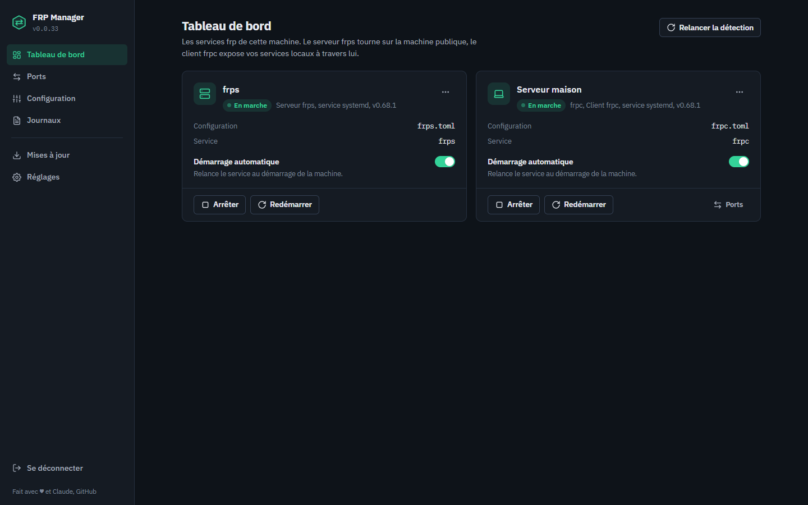
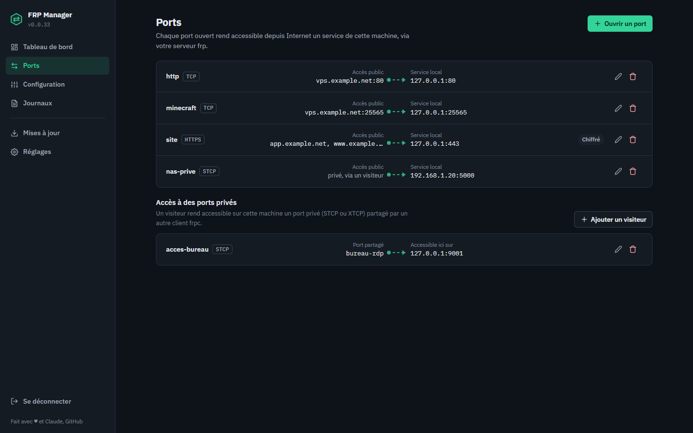
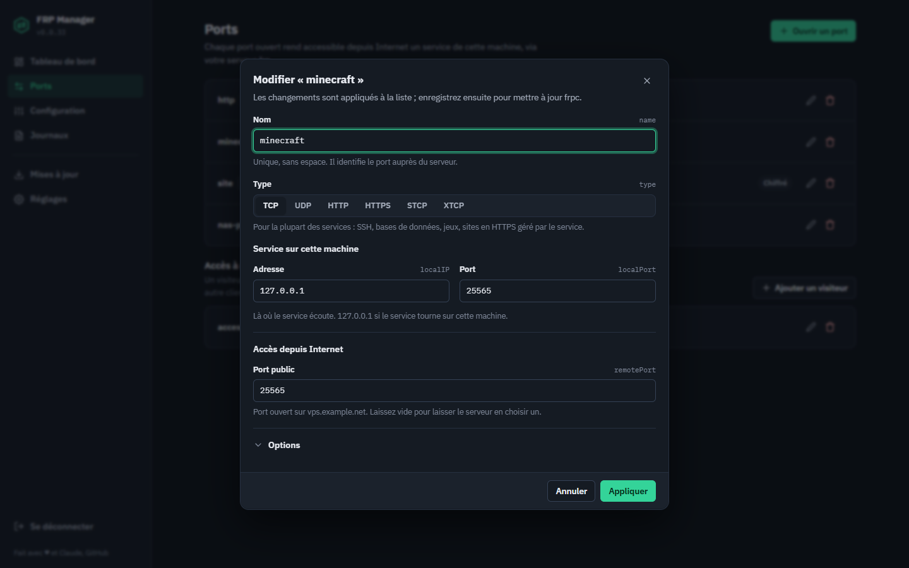
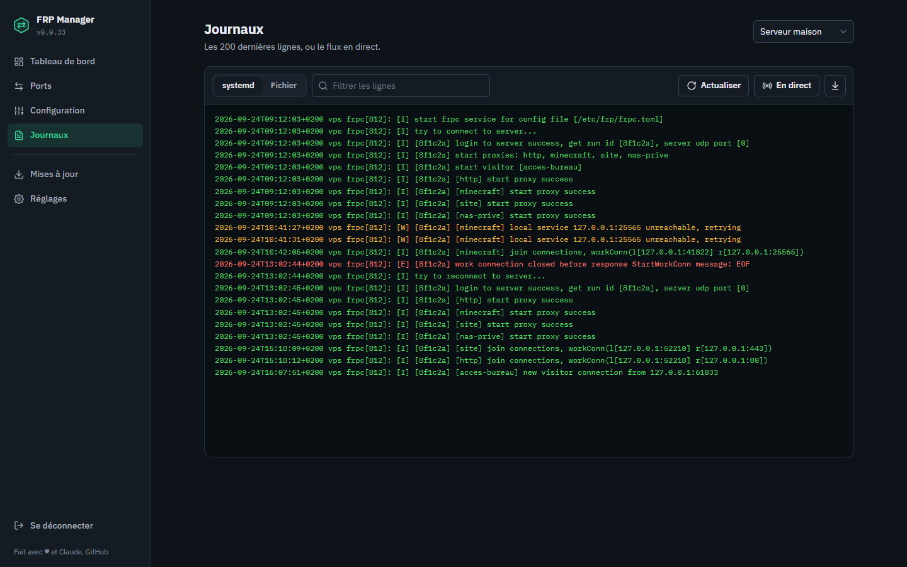

# FRP Manager

A self-hosted web UI and dashboard for [frp](https://github.com/fatedier/frp): run **frps** and **frpc** from your browser instead of editing TOML files, restarting systemd units and reading logs over SSH.

[](LICENSE)
[](https://github.com/Gogowwww/frp-manager/releases)

[](https://github.com/users/Gogowwww/packages/container/package/frp-manager)
[](https://frp-manager.gogow.fr)

**English** · [Français](README.fr.md)



## Quick start

With Docker Compose, on the machine that runs (or will run) frps or frpc:

```bash
curl -O https://raw.githubusercontent.com/Gogowwww/frp-manager/main/docker-compose.yml
docker compose up -d
```

The panel listens on `127.0.0.1:8765` only. From your computer, open an SSH tunnel with `ssh -L 8765:127.0.0.1:8765 user@server`, browse to `https://127.0.0.1:8765` and create the administrator account. To open it to your network, see [Reaching the panel from another machine](docs/installation.md#reaching-the-panel-from-another-machine).

Without Docker, the install script sets up the panel, frp and their systemd services:

```bash
curl -LO https://github.com/Gogowwww/frp-manager/releases/latest/download/frp-manager.zip
unzip frp-manager.zip && cd frp-manager && sudo bash install.sh
```

Not ready to install? The [live demo](https://frp-manager.gogow.fr/demo/) runs the real interface with sample data.

## Features

- **Dashboard**: automatic detection of frps/frpc systemd services, binaries, configs and Docker containers; start, stop, restart, start on boot; live status over WebSocket; nicknames.
- **Ports (frpc)**: readable list (`vps.example.net:25565 → 127.0.0.1:25565`) and a guided editor for `tcp`, `udp`, `http`, `https`, `stcp`, `xtcp` and visitors, with PROXY protocol, encryption and compression options. Settings the editor does not handle are kept as they are.
- **Firewall (frps)**: allow-only or block rules by address, network or whole provider (AS number), applied in the kernel with nftables before Docker's NAT; blocked connections in real time; optional community lists.
- **Configuration**: frps and frpc settings in sections, each field showing its TOML key; configs are parsed before being written.
- **Logs**: systemd journal, log file or Docker container, streamed live (WebSocket, SSE fallback), with a filter.
- **Updates**: one-click frp install with SHA-256 verification, manual archive upload, one-click panel update.
- **Interface**: light and dark themes, desktop and mobile, in English and French (picked from your browser, changeable in Settings).

| Ports | Port editor | Live logs |
|:---:|:---:|:---:|
|  |  |  |

## Why this panel

frp is a single binary configured by TOML files. Running it by hand works well, but day-to-day management stays manual: editing a file over SSH for every new port, restarting the right unit, checking which port is already taken, finding the right log. FRP Manager keeps that model and adds a layer on top of it:

| Task | Manual frp | FRP Manager |
|---|---|---|
| Add or change a tunnel | edit `frpc.toml`, restart frpc | guided form, TOML validated before saving, save and restart in one click |
| See what is exposed | read the configs | list of ports with their path, per client |
| Several frps/frpc instances | one unit and one file per instance to track | detected automatically, one card each |
| Filter who reaches frps ports | write nftables or iptables rules | rules by IP, network or AS, tested before applying |
| Follow logs | `journalctl -fu frpc` over SSH | live logs in the browser |
| Update frp | download, check, replace the binaries, restart | one click, SHA-256 checked, services restarted |

The panel does not replace frp nor change its configuration format: files stay plain TOML that you can still edit by hand, and removing the panel leaves frp running as before.

## Security

The panel controls exposed ports and runs as root, so it is locked down by default:

- **Mandatory initial setup**: no page or API route answers until an administrator account exists (password of 12 characters or more).
- **Password hashing** with argon2id (scrypt as a fallback); older SHA-256 hashes are accepted once and rehashed automatically.
- **Listens on `127.0.0.1`** in a new install; opening it to the network is an explicit choice.
- **Brute-force protection**: attempts limited per IP, with a growing lockout.
- **Web hardening**: CSRF token on every change, HttpOnly / SameSite=Strict / Secure cookies, Content-Security-Policy, X-Frame-Options, Referrer-Policy.
- **System hardening**: no shell commands built from user input, allow-listed service and container names, configs confined to frp's directories, safe archive extraction.
- **Supply chain**: frp archives and panel updates checked against their published SHA-256; third-party mirrors (ghproxy, ghfast, gh-proxy) can be disabled and are never used without a checksum.

> **Docker warning**: the container uses `pid: host`, `privileged: true` and `nsenter` to drive systemd on the host, plus the Docker socket. **That is root-equivalent access to the host**: anyone who controls the panel controls the machine. Read [docs/docker.md](docs/docker.md) before deploying it.

Threat model and vulnerability reporting: [SECURITY.md](SECURITY.md).

## Documentation

- [Website](https://frp-manager.gogow.fr): overview, live demo and the full documentation
- [Installation, configuration and uninstall](docs/installation.md): requirements, Docker images, versions and pre-releases, configuration keys, reverse proxy, lost password, file structure
- [Docker: privileges and risks](docs/docker.md)
- [Security policy](SECURITY.md)
- [Changelog](CHANGELOG.md)

## Contributing

Bug reports, ideas, translations and pull requests are welcome: see [CONTRIBUTING.md](CONTRIBUTING.md) and the [code of conduct](CODE_OF_CONDUCT.md). Addresses worth blocking can be shared through the firewall's **Publish** button or on the [`blocklists`](https://github.com/Gogowwww/frp-manager/tree/blocklists) branch.

## License

[Apache 2.0](LICENSE).

## Acknowledgements

[fatedier/frp](https://github.com/fatedier/frp), the project this panel is built around.

## Development

FRP Manager is developed with the help of an AI coding assistant ([Claude](https://claude.ai)). New versions ship as pre-releases first, to be tested before being promoted to a release.

[](https://www.star-history.com/?repos=Gogowwww%2Ffrp-manager&type=date&legend=bottom-right)
