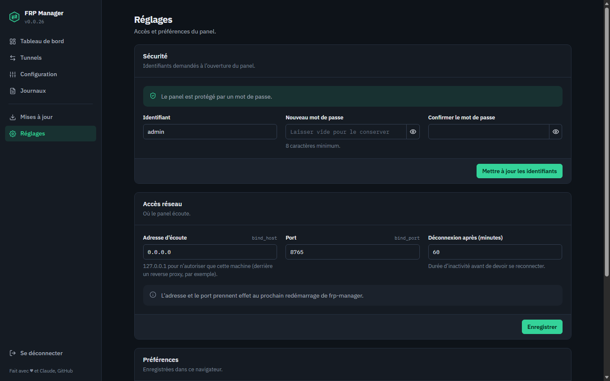

# 🌐 FRP Manager

> 🚀 A self-hosted web panel to run [frp](https://github.com/fatedier/frp) (**frps** & **frpc**) without the command line: services, open ports, configuration, logs and updates, in a clean interface, light or dark, on desktop and mobile.


[](https://github.com/Gogowwww/frp-manager/stargazers)
[](https://claude.ai)

<p align="center">
  <a href="README.md"></a>
  <a href="README.fr.md"></a>
</p>

<p align="center">
  <a href="https://demo-frp-manager.gogow.fr"></a>
</p>

> 🎮 **[Try the live demo](https://demo-frp-manager.gogow.fr)**: the real interface with sample data, nothing to install. Everything can be clicked, nothing is actually changed.

> 🌍 **The panel's interface in English** is available as a preview in **Settings → Preferences → Language**. Until its official release, some messages sent by the server stay in French.

---

## 📑 Table of contents

- [🖥️ Preview](#️-preview)
- [📖 Overview](#-overview)
- [✨ Features](#-features)
- [📋 Requirements](#-requirements)
- [⚙️ Installation](#️-installation)
- [🏷️ Versions and pre-releases](#️-versions-and-pre-releases)
- [🔧 Panel configuration](#-panel-configuration)
- [🗂️ File structure](#️-file-structure)
- [🌍 Translating the panel](#-translating-the-panel)
- [🔒 Security](#-security)
- [🗑️ Uninstall](#️-uninstall)
- [🤝 Contributing](#-contributing)
- [📄 License](#-license)

---

## 🖥️ Preview

> 🎮 Rather than screenshots, try it in the **[live demo](https://demo-frp-manager.gogow.fr)**.

| Dashboard | Ports |
|:---:|:---:|
|  |  |
| **Opening a port** | **Live logs** |
|  |  |

<details>
<summary>⚙️ Settings</summary>



</details>

---

## 📖 Overview

**FRP Manager** manages your **frps** instances (the server, on the public machine) and **frpc** instances (the client, which exposes your local services through it) from a browser.

It detects your frp systemd services and Docker containers on its own, starts over **HTTPS** with a self-signed certificate generated on first launch, and works just as well with a single instance as with several frp servers side by side.

> 💡 **Why FRP Manager?**
> frp is powerful, but managing it stays manual: TOML files, systemd restarts, logs over SSH. FRP Manager brings all of that together in an interface designed to be understood without knowing frp by heart, while still showing the TOML key of every setting for power users.

---

## ✨ Features

### 📊 Dashboard
- 🔍 **Automatic detection** of frps/frpc services (systemd units, binaries, configs) and frp Docker containers
- 🪪 **One card per instance**: plain status (*Running*, *Stopped*, *Not found*), version, config file, service
- ▶️ **Start / Stop / Restart** in one click, **start on boot** as a toggle, config reload
- 🛑 **Confirmation before stopping** an frpc: if you reach the panel through one of its ports, you are warned
- ✏️ **Nicknames** for instances (*"Home server"*, *"Office access"*…)
- 🔔 Useful alerts at the top of the page: panel without a password, update available
- ⚡ **Live status**: pushed over WebSocket as soon as a service changes (falls back to a check every 12 s if WebSocket doesn't get through)

### 🔌 Ports (frpc)
- 🗺️ **Readable list**: each port shows its path `vps.example.net:25565 → 127.0.0.1:25565`
- 📝 **Guided editor**: `tcp`, `udp`, `http`, `https`, `stcp`, `xtcp`, with an explanation for each type; public port, domains or secret key depending on the type; PROXY protocol v1/v2, encryption and compression options
- 🔐 **Visitors** (`[[visitors]]`): local access to a private STCP/XTCP port shared by another machine
- 💾 **Draft, then save**: changes pile up and a bar offers *Save* or *Save and restart frpc*; you are warned if you leave without saving
- 🧷 **Nothing is lost**: settings the interface doesn't handle (`subdomain`, `plugin`, `[proxies.healthCheck]`…) are kept as they are

### 🛡️ Firewall (frps)
- 🚦 **Who can connect** to the ports opened by frps: *Allow only* (allowlist) or *Block* (blocklist) rules, on selected ports or on **all frp ports**
- 🏢 **By address, network or whole provider**: `203.0.113.4`, `198.51.100.0/24` or an AS number (`AS16276`), whose prefixes are fetched from RIPEstat and refreshed daily
- 🔎 **Ports detected automatically**: `bindPort`, vhost ports, KCP/QUIC, `allowPorts`, and the ports opened by clients (through the frps dashboard, if enabled); the list is followed automatically
- 🧱 **Kernel-level filtering** (nftables, dedicated `inet frp_manager` table), before Docker's NAT: an frps in a container is filtered too, and **filtering keeps working if the panel stops**
- 🙅 The firewall **only blocks**: it never opens a port and touches neither ufw nor Docker's rules; the panel port and loopback are never filtered
- 🧪 **Test an address** before applying, with an **alert** if your rules would block your own IP
- 📡 **Blocked connections in real time** (WebSocket, automatic fallback): address, provider (AS), port, rule, per-rule counter; one click blocks the address or its whole AS
- 🌍 **Community lists** (to block or to allow only): subscribe in one click to a list from the catalog (the rule keeps itself up to date), or **publish** your own: the panel prepares a GitHub issue, you submit it, it is checked and added automatically within minutes; the catalog lives on the [`blocklists`](https://github.com/Gogowwww/frp-manager/tree/blocklists) branch

> ℹ️ Requires `nftables` on the machine: if it is missing, the page offers an **Install nftables** button (apt, dnf, yum, apk, pacman or zypper). The page only appears if an frps runs on the machine.

### ⚙️ Configuration (frps / frpc)
- 🧩 **Form in sections**: the essentials in view (connection, authentication, frp dashboard), the rest folded into *Advanced settings* (TLS, KCP/QUIC/vhost ports, limits, logging)
- 🏷️ Each field shows its **TOML key** and a short hint
- 🛡️ An frpc's ports are **preserved** when you save its configuration

### 📜 Logs
- 📂 Source: **systemd journal**, **log file** or **Docker container** (with or without `tty`)
- 📡 **Live stream over WebSocket** (`wss://` when the panel uses HTTPS) on the chosen source, with automatic fallback to SSE if WebSocket doesn't get through; errors and warnings highlighted, line **filter**

> 🔀 Behind a reverse proxy, allow the WebSocket upgrade on `/ws/` (nginx: `proxy_http_version 1.1;` + `Upgrade` and `Connection` headers). Without it, the panel simply falls back to SSE.

### ⬆️ Updates
- **frp**: checks for the latest version, one-click install with **fallback mirrors** (ghproxy, ghfast, gh-proxy), **manual upload** of an archive if GitHub can't be reached, source access test
- **Panel**: one-click update (standard install) or a `docker pull` command to copy (Docker); a **pre-release never offers an update** (see [Versions and pre-releases](#️-versions-and-pre-releases))

### 🎛️ Settings
- 🔐 Panel username and password
- 🌐 Listening address and port, session length
- 🎨 **Theme** system / light / dark, **language**: French, English as a preview (official release in an upcoming version)

### 🐳 Docker
- The panel can run **in a container** and drive frp **on the host** (through `nsenter`, no systemd in the image)
- It also detects and controls **frpc/frps containers** from other stacks (start, stop, restart, logs, ports)

---

## 📋 Requirements

- 🐧 Linux with **systemd**
- 🐍 **Python 3.8+** (standard install) or **Docker**
- 🏗️ Architectures: `amd64`, `arm64`, `arm`

> ℹ️ **No need to install frp first**: `install.sh` downloads `frps`/`frpc` and creates their systemd services. frp is then updated from the **Updates** page.

---

## ⚙️ Installation

### 🥇 Method 1 — Install script (recommended)

```bash
# 1. Download the latest release
curl -LO https://github.com/Gogowwww/frp-manager/releases/latest/download/frp-manager.zip
unzip frp-manager.zip && cd frp-manager

# 2. Install (root required)
sudo bash install.sh
```

The script installs the panel in an isolated Python environment, creates the `frp-manager` systemd service and starts it. It **also prepares frp**:

- ⬇️ `frps` / `frpc` binaries in `/usr/local/bin` (latest version, with fallback mirrors);
- 📄 default configs `/etc/frp/frps.toml` and `/etc/frp/frpc.toml`, **only if they don't exist yet**;
- 🧱 `frps.service` and `frpc.service` services, created but **neither enabled nor started**: you configure them, then start them from the panel.

### 🐳 Method 2 — Docker / Portainer

**Docker Compose:**
```bash
git clone https://github.com/Gogowwww/frp-manager.git && cd frp-manager
docker compose up -d
```

**Portainer:** *Stacks → Add stack → Repository*, URL `https://github.com/Gogowwww/frp-manager`, compose path `docker-compose.yml`, then *Deploy the stack*.

| Image | Contents |
|---|---|
| `ghcr.io/gogowwww/frp-manager:latest` | latest stable release (**recommended**) |
| `ghcr.io/gogowwww/frp-manager:X.Y.Z` | a specific version, to pin it or roll back |
| `ghcr.io/gogowwww/frp-manager:dev` | latest pre-release, to test before everyone else |

> 🔧 The container uses `pid: host` and `nsenter` to reach the host's systemd, and the Docker socket for frp containers. frp binaries are read and written in the host's `/usr/local/bin` through the `/host/usr/local/bin` mount.

The interface is then available at:
```
https://YOUR_IP:8765
```

> ⚠️ The certificate is self-signed: your browser shows a warning on first access, that's expected. For a valid certificate, put the panel behind a reverse proxy (nginx, Caddy).

---

## 🏷️ Versions and pre-releases

Every new version first ships as a **pre-release**, to be tested before it is offered to everyone. Numbers follow each other (`0.0.25`, `0.0.26`…) and a validated pre-release becomes the final release **with the same number**, without being rebuilt.

| | Pre-release | Release |
|---|---|---|
| GitHub page | marked *Pre-release* | *Latest* |
| Docker image | `:X.Y.Z` + `:dev` | `:X.Y.Z` + `:latest` |
| Offered to stable panels | ❌ | ✅ |
| Offered to pre-release panels (standard install) | ✅ | ✅ |

- **Stable panel**: it only sees releases, never pre-releases.
- **Pre-release panel, standard install**: it follows the pre-release channel and the "Update" button offers the most recently published version, pre-release or release.
- **Pre-release panel under Docker**: no update is offered in the interface; change the image tag (`:dev` to follow pre-releases, `:latest` to go back to releases).

When the installed pre-release becomes a final release, the panel switches back to the stable channel on its own.

> ℹ️ **0.0.26: the "Real IP" option (go-mmproxy) has been removed.** If you used it, the panel automatically points the affected tunnels back to their real service on first start, restarts frpc, then removes the relays, the routing rules and the `go-mmproxy` binary. To pass on visitors' IP addresses, use the **PROXY protocol** option with a service that supports it (nginx, HAProxy…).

---

## 🔧 Panel configuration

Everything is set from the **Settings** page. The underlying file is `/etc/frp-manager/frp-manager.json`:

```json
{
  "bind_host": "0.0.0.0",
  "bind_port": 8765,
  "username": "admin",
  "password_hash": "",
  "session_timeout": 3600,
  "ssl_enabled": true,
  "nicknames": {}
}
```

| 🔑 Key | 📝 Description | 🎯 Default |
|---|---|---|
| `bind_host` | Listening address (`127.0.0.1` behind a reverse proxy) | `0.0.0.0` |
| `bind_port` | Panel port | `8765` |
| `username` | Login username | `admin` |
| `password_hash` | Hashed password (managed by the interface) | `""` *(none)* |
| `session_timeout` | Session length in seconds | `3600` |
| `ssl_enabled` | HTTPS with a self-signed certificate | `true` |
| `nicknames` | Instance nicknames (managed by the interface) | `{}` |

> 🔁 `bind_host`, `bind_port` and `ssl_enabled` apply the next time `frp-manager` restarts.

---

## 🗂️ File structure

```
📦 Repository
  app.py                   # Flask server + API
  frp-autoupdate.py        # Automatic frp updates (cron)
  install.sh               # Standard install
  Dockerfile, docker-compose.yml
  templates/
    index.html, login.html # Pages (shell)
    partials/icons.html    # SVG icons
    assets/
      css/app.css          # Design system (light/dark themes)
      js/                  # Application (ES modules, no build step)
        pages/             # Dashboard, Ports, Configuration, Logs…
      locales/fr.js, en.js # Interface texts (French, English)

📁 /opt/frp-manager/        # Installed panel (script method)
📁 /etc/frp-manager/        # Panel configuration + SSL certificates
📁 /etc/frp/                # frps/frpc configurations (TOML)
📁 /var/log/frp/            # frp logs
📁 /var/lib/frp-manager/    # State (installed versions)
📁 /etc/systemd/system/     # frp-manager.service, frps.service, frpc.service
📁 /etc/cron.d/             # frp-autoupdate (daily check, 3:00 AM)
```

---

## 🌍 Translating the panel

All interface texts live in `templates/assets/locales/`: `fr.js` (reference language) and `en.js` (English). To add a language:

1. Copy `fr.js` to `<code>.js` (`de.js`, `es.js`…) and translate the values, without touching the keys or the `{parameters}`;
2. Declare the language in `LOCALES` in `templates/assets/js/i18n.js`;
3. It shows up in **Settings → Preferences → Language**, and the browser picks it automatically when it matches its language.

A language still in progress also goes into `PREVIEW_LOCALES`: it is offered in Settings marked *preview*, but never picked from the browser language. That's the case for English until its official release.

> Messages sent by the server are still in French for now.

---

## 🔒 Security

- 🔑 **Set a password** right after installing (**Settings → Security**): the dashboard reminds you as long as there is none
- 🧱 **Restrict access by IP** (firewall) or listen on `127.0.0.1` behind a reverse proxy
- 📜 For a **valid certificate**, use a reverse proxy (nginx, Caddy) with Let's Encrypt
- 🎲 Use a **long, unique frp token** per server

---

## 🗑️ Uninstall

```bash
sudo systemctl disable --now frp-manager
sudo rm /etc/systemd/system/frp-manager.service
sudo rm -rf /opt/frp-manager /etc/frp-manager /etc/cron.d/frp-autoupdate
sudo systemctl daemon-reload
```

> ⚠️ frp configurations (`/etc/frp/`) and binaries (`/usr/local/bin/`) are kept.

---

## 🤝 Contributing

Contributions are welcome:

1. 🍴 Fork the repository
2. 🌿 Create a branch: `git checkout -b feature/my-feature`
3. 💾 Commit your changes
4. 📬 Open a Pull Request

> 🐛 Bug or idea? Open an [issue](https://github.com/Gogowwww/frp-manager/issues).

> 🌍 A list of addresses to block that you'd like to share? Use the **Publish** button on a *Block* firewall rule, or open a Pull Request on the [`blocklists`](https://github.com/Gogowwww/frp-manager/tree/blocklists) branch.

---

## 📄 License

**Apache 2.0** — see [LICENSE](LICENSE)

---

## 🙏 Acknowledgements

- [fatedier/frp](https://github.com/fatedier/frp) — the frp project, without which none of this would make sense
- 💛 The open source community for feedback and contributions

---

## ✨ Vibecoding

<div align="center">

*This project was entirely designed, built and iterated through **vibecoding** with AI.*

[](https://claude.ai)

> *"Vibe, iterate, ship."*

</div>

---

## ⭐ Star History

[](https://www.star-history.com/?repos=Gogowwww%2Ffrp-manager&type=date&legend=bottom-right)
